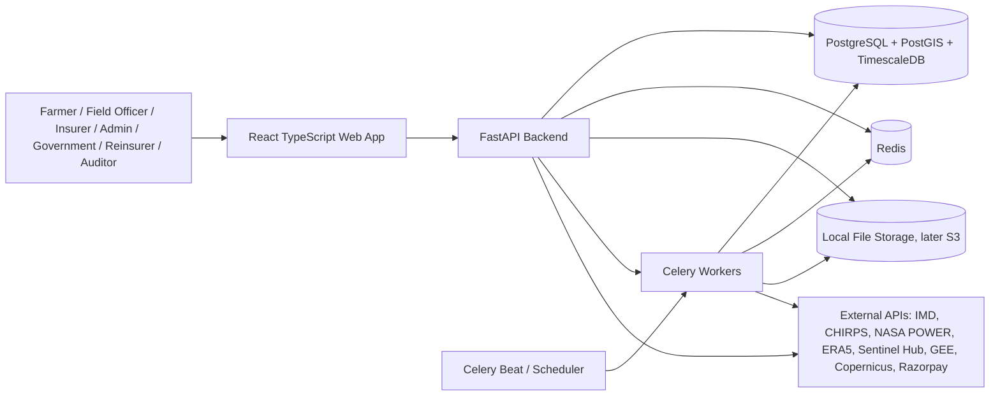
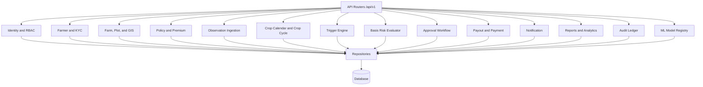
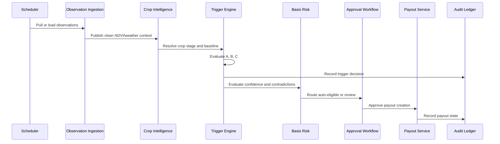

# Phase 2 - System Architecture

## Phase Status

Status: Complete

This phase converts Phase 1 requirements into a production-oriented architecture. It creates the technical boundaries, deployment shape, module ownership, repository structure, integration contracts, and implementation gates for later phases.

No database migration, backend route, frontend screen, GIS layer, ML model, test suite, or deployment manifest is implemented in this phase. The empty folder scaffold exists to make the architecture concrete and to give later phases stable ownership boundaries.

## 1. Architecture

### 1.1 Architecture Style

The platform starts as a modular monolith with asynchronous workers, then can evolve into services if throughput, ownership, or deployment needs demand it.

Why this choice:

- The first product slice has tightly coupled domain workflows: policy, observation, trigger, basis risk, approval, payout, notification, and audit.
- A modular monolith keeps transactional consistency simpler while the business rules are still being validated.
- Bounded contexts, repository interfaces, and adapter boundaries prevent the codebase from becoming a single tangled application.
- Celery workers isolate expensive ingestion, trigger runs, reports, notifications, and ML jobs without forcing premature microservices.

### 1.2 Logical Containers



### 1.3 Backend Components



### 1.4 Bounded Contexts

| Context | Responsibility | Owns |
|---|---|---|
| Identity and Access | Users, roles, permissions, sessions, JWT, refresh tokens, RBAC checks. | Users, roles, permissions, refresh tokens. |
| Farmer and KYC | Farmer profile, contact verification, documents, privacy-safe identity references. | Farmers, KYC documents, verification state. |
| Farm and GIS | Farms, plots, parcel geometry, boundaries, map layer metadata, spatial queries. | Farms, plots, geometries, admin boundaries. |
| Policy and Premium | Policy lifecycle, policy crops, quote inputs, premium rules, policy status. | Policies, policy crops, premium calculations. |
| Observation Ingestion | Weather, satellite, rainfall, NDVI, RVI, soil moisture, data-source adapters. | Observation records, source provenance, ingestion logs. |
| Crop Intelligence | Crop calendar, crop-stage resolution, crop cycles, NDVI baselines. | Crop calendar, crop cycles, NDVI baselines. |
| Trigger Engine | Trigger A/B/C evaluation, reason codes, payout percentage, trigger event creation. | Trigger rules and trigger events. |
| Basis Risk | Manual-review flags, contradictory-index checks, confidence thresholds. | Basis-risk flags and resolution state. |
| Approval Workflow | Underwriter/field-officer decisions, state transitions, payout approval gate. | Payout approvals. |
| Payout and Payment | Payout record creation, payment adapter, reconciliation, payout state. | Payout records and payment references. |
| Notification | SMS/email/push/webhook templates and delivery tracking. | Notification logs. |
| Reporting and Analytics | Aggregations, exports, executive dashboards, audit-friendly summaries. | Read models and export jobs. |
| Audit Ledger | Append-only event log for security, compliance, and traceability. | Audit log and record hashes. |
| ML Registry | Model versions, prediction runs, reproducibility metadata. | Model versions and prediction runs. |

### 1.5 Data Architecture

The data platform uses PostgreSQL as the system of record, PostGIS for spatial data, and TimescaleDB for observation time series.

Database principles:

- Domain tables are normalized first; reporting views can denormalize later.
- Geometries use SRID `4326` unless a module explicitly needs projected calculations.
- NDVI, RVI, rainfall, soil-moisture, and temperature records are time-series data.
- Trigger events, payout records, and audit logs are immutable once created.
- Every automated decision stores source values, rule version, model version, confidence, and reason code.
- Sensitive identity and bank details are stored as hashes or external secure references, never raw values.

Storage principles:

- Phase 1 and Phase 2 use only local file references for documentation and static artifacts.
- Phase 4 and later can use local storage for generated reports.
- Production storage should use object storage, preferably S3-compatible, for source rasters, generated reports, certificates, and uploaded documents.
- Raster files should be Cloud Optimized GeoTIFFs when geospatial access is required.

### 1.6 Integration Architecture

All external data sources are accessed through adapters, never directly from trigger or payout logic.

Adapter groups:

- Weather: IMD, CHIRPS, ERA5, NASA POWER, OpenWeather, Tomorrow.io.
- Satellite: Sentinel Hub, Google Earth Engine, Copernicus, USGS, ISRO Bhuvan.
- Payment: Razorpay, UPI/NEFT/IMPS adapter boundary.
- Government and compliance: PMFBY, Agristack, land records, SDMA, DAO approval.
- Notification: SMS, email, push, webhook.

Integration rule:

- Mock/demo adapters and live adapters must return the same internal DTO shape. Replacing mock data with live data should not change trigger, approval, or payout logic.

### 1.7 Security Architecture

Security controls:

- JWT access tokens with refresh-token rotation.
- RBAC enforced at route and service-operation level.
- Password hashing with a modern algorithm such as Argon2 or bcrypt.
- Strict Pydantic validation for request input.
- ORM and parameterized queries to avoid SQL injection.
- Secure HTTP headers and HTTPS readiness.
- Audit logging for auth, role changes, policy changes, trigger runs, approvals, payouts, exports, and settings changes.
- Rate limiting on public and sensitive endpoints.
- Secrets outside source control and injected through environment or a secrets manager.
- Raw Aadhaar, bank account, and payment details must not be stored in the application database.

### 1.8 Observability Architecture

Observability requirements:

- Structured JSON logs with request ID, actor ID, role, action, entity, and correlation ID.
- Health endpoints for API, database, Redis, worker, and storage.
- Metrics for ingestion success, trigger runs, trigger latency, approval backlog, payout latency, notification delivery, API errors, and external API failures.
- Worker task status and retry tracking.
- Audit records for business-critical actions.

### 1.9 Deployment Architecture

Local development target:

- Frontend Vite dev server.
- FastAPI with Uvicorn.
- PostgreSQL with PostGIS and TimescaleDB.
- Redis.
- Celery worker and scheduler.
- Local file storage.

Production target:

- Frontend static build behind CDN or Nginx.
- FastAPI containers behind an ingress or load balancer.
- Celery workers separated by queue: ingestion, triggers, reports, notifications.
- Managed PostgreSQL with PostGIS/TimescaleDB support or self-managed TimescaleDB.
- Managed Redis.
- Object storage for documents, reports, and rasters.
- Secrets manager.
- Backup and disaster recovery plan.

## 2. Folder Structure

The scaffold below is now created in the repository. Later phases should fill these boundaries rather than invent new top-level shapes.

```text
parametric-insurance/
  backend/
    app/
      api/v1/
      core/
      db/
      models/
      repositories/
      schemas/
      services/
        adapters/
        trigger/
      workers/
    alembic/versions/
    tests/unit/
    tests/integration/
  frontend/
    src/
      assets/
      components/
        charts/
        layout/
        map/
        shared/
        ui/
      hooks/
      lib/
      pages/
        admin/
        analytics/
        auth/
        basis-risk/
        claims/
        dashboard/
        farmer/
        gis/
        ndvi/
        payouts/
        policies/
        reports/
        settings/
        triggers/
      router/
      store/
      styles/
  database/
    migrations/
    seeds/
    views/
  docs/
    adr/
    diagrams/
  infra/
    docker/
    k8s/
    terraform/
  ml/
    data/
      gis/
      processed/
      raw/
    models/
    notebooks/
    scripts/
  shared/
    contracts/
    domain/
```

Ownership rules:

- `backend/app/api` contains transport concerns only.
- `backend/app/services` contains business rules.
- `backend/app/repositories` contains persistence access.
- `backend/app/models` contains ORM models after Phase 4.
- `backend/app/schemas` contains API DTOs after Phase 4.
- `backend/app/services/adapters` contains mock and external provider adapters.
- `backend/app/services/trigger` owns trigger formulas and payout ladder logic.
- `frontend/src/pages` contains route-level screens.
- `frontend/src/components` contains reusable UI and visualization components.
- `shared/contracts` stores API and event contracts when introduced.
- `shared/domain` stores business and architecture catalogs.

## 3. Database Changes

No database migration is applied in Phase 2.

Phase 3 must produce:

- PostgreSQL extension setup for PostGIS, TimescaleDB, UUID, and cryptographic hashing.
- Normalized tables for all Phase 1 entities.
- Spatial indexes for geometries.
- Time-series hypertables for NDVI, RVI, rainfall, temperature, and soil moisture observations.
- Immutable audit and payout design.
- Trigger-rule versioning.
- Crop-cycle and ML model-version traceability.
- Views for dashboards and approval queues.
- Seed data for roles, permissions, default trigger rules, stress bands, and source adapters.

Database architecture decisions for Phase 3:

- Use UUIDs for externally exposed business entities such as users, farmers, policies, payouts, reports, and documents.
- Use integer or big integer IDs for high-volume internal event rows where appropriate.
- Use explicit enum types only for stable domain states; use lookup tables or constrained text for states likely to change often.
- Store raw observations separately from derived trigger events.
- Store sample/demo records with source labels so they cannot be confused with verified production data.

## 4. API Design

No API endpoint is implemented in Phase 2.

API architecture for Phase 4:

- REST APIs under `/api/v1`.
- OpenAPI documentation generated from FastAPI.
- JSON request and response bodies.
- Bearer token authentication.
- Pagination, filtering, sorting, and search on list endpoints.
- Consistent error shape.
- Idempotency keys for trigger runs, approval actions, payout creation, and payment initiation.
- Correlation IDs propagated to logs, worker jobs, and audit records.

Planned API groups:

| Group | Responsibility |
|---|---|
| Auth | Login, refresh, logout, current user, password reset later. |
| Users and RBAC | Users, roles, permissions, role assignment. |
| Farmers and KYC | Farmer profiles, documents, verification state. |
| Farms and GIS | Farms, plots, boundaries, map layers, spatial filters. |
| Policies | Policy lifecycle, policy crops, certificates. |
| Premiums | Quote calculation and premium rules. |
| Observations | Weather, satellite, NDVI, RVI, rainfall, soil moisture, temperature. |
| Crop Intelligence | Crop calendar, crop cycles, baselines. |
| Triggers | Trigger rules, trigger events, manual trigger runs. |
| Basis Risk | Flags, review reasons, resolution actions. |
| Approvals | Approval queue and state transitions. |
| Payouts | Payout records, payment status, reconciliation hooks. |
| Claims | Claim audit and supporting evidence. |
| Reports | CSV/PDF/Excel export requests and downloads. |
| Dashboards | KPI aggregates and chart data. |
| Notifications | Notification log and templates. |
| Audit | Immutable event review. |
| Settings | Data sources, thresholds, system configuration. |

## 5. UI Screens

The frontend architecture uses a role-aware app shell with shared components and route-level pages.

Core UX structure:

- Public marketing pages: landing, about, products, solutions, pricing, contact.
- Auth pages: login, register, forgot password.
- Operations shell: sidebar, topbar, role switch, notification drawer, command/search.
- Dashboards: executive, farmer, insurance, GIS, risk, analytics, government, reinsurance.
- Work queues: basis-risk queue, payout approval queue, trigger monitor, field verification queue.
- Detail pages: policy, farmer, farm/plot, trigger event, payout, claim/audit.
- GIS and satellite views: full-screen map, NDVI curve viewer, layer controls, time slider.
- Admin pages: users, roles, crops, districts, triggers, premium rules, data sources, settings.

UI implementation rules for Phase 5:

- Use dense, operational SaaS layouts for dashboards and queues.
- Use map-first layouts for GIS and risk pages.
- Use tabs for detail pages with related subviews.
- Use charts only where they answer an underwriting, risk, compliance, or farmer-service question.
- Status must be visually consistent across stress band, approval, payment, review, and data quality states.

## 6. Workflow

### 6.1 Monitoring and Trigger Workflow



### 6.2 Approval State Model

```text
pending_review -> auto_approved -> payout_pending -> payment_initiated -> paid
pending_review -> under_review -> approved -> payout_pending -> payment_initiated -> paid
pending_review -> under_review -> rejected
pending_review -> under_review -> field_verification_required -> approved
pending_review -> under_review -> on_hold
```

State rules:

- Trigger events can be created automatically.
- Payout records are created only after auto-approval or explicit approval.
- Extreme stress and unknown/fallow cases cannot be auto-approved.
- Rejected trigger events stay auditable and cannot be deleted.
- Payment failures are retried or reconciled through payout state, not by creating duplicate payouts.

### 6.3 Data Adapter Workflow

```text
provider adapter -> provider DTO validation -> internal observation DTO -> quality flags -> persistence -> trigger context
```

Adapter rules:

- Mock data, CSV/XLSX ingestion, and live APIs use the same internal DTOs.
- Provider-specific errors stay inside adapters.
- Business services receive normalized observations with source, timestamp, quality, geometry/plot reference, and provenance.

## 7. Code

Phase 2 code artifact:

```text
shared/domain/phase2-architecture.json
```

Purpose:

- Define containers, bounded contexts, technology choices, API groups, queues, data stores, and implementation gates in machine-readable form.
- Provide a stable source for Phase 3 schema design and Phase 4 backend module generation.
- Keep architecture decisions traceable instead of burying them only in markdown.

Diagram source files are stored in:

```text
docs/diagrams/
```

Scaffold files:

- `.gitkeep` files are used only to preserve architecture folders before implementation.
- They are not placeholder application code.

## 8. Best Practices

- Keep business logic out of route handlers and UI components.
- Treat integrations as replaceable adapters.
- Make trigger runs idempotent and replayable.
- Store every automated decision with input evidence and rule/model version.
- Prefer explicit domain states over ambiguous boolean fields for workflows.
- Separate trigger event creation from payout record creation.
- Keep audit logging append-only.
- Make dashboard queries read-optimized through views or query services after the normalized schema is in place.
- Do not allow sample geometry or mock observations to look like verified production data.
- Enforce RBAC twice: route-level access and service-level action permission.
- Keep farmer-facing experiences mobile-first and lightweight.
- Avoid premature microservices until bounded contexts have clear independent scaling or ownership needs.

## 9. Phase 2 Acceptance Criteria

Phase 2 is complete when:

- Architecture style and container model are documented.
- Bounded contexts and ownership rules are documented.
- Backend, frontend, data, worker, integration, security, and observability architecture are defined.
- Folder scaffold is created.
- Database expectations are deferred to Phase 3 with clear decisions.
- API groups are defined without implementing endpoints.
- UI screen architecture is defined without implementing frontend screens.
- Workflows are modeled.
- Machine-readable architecture artifact exists.
- Diagram source files exist.

All criteria are satisfied by this document, the scaffold, the diagram files, and `shared/domain/phase2-architecture.json`.

## 10. Next Phase Gate

Next phase: Phase 3 - Database Schema

Phase 3 should create the normalized PostgreSQL/PostGIS/TimescaleDB schema, migrations, seed strategy, and schema documentation. It should not implement backend APIs or frontend screens.
